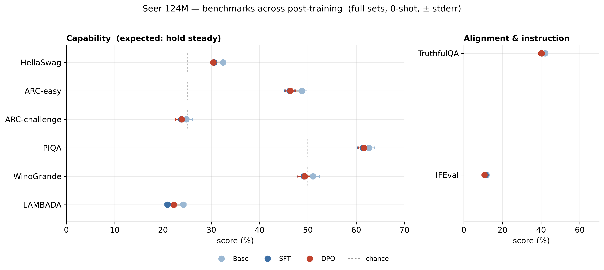
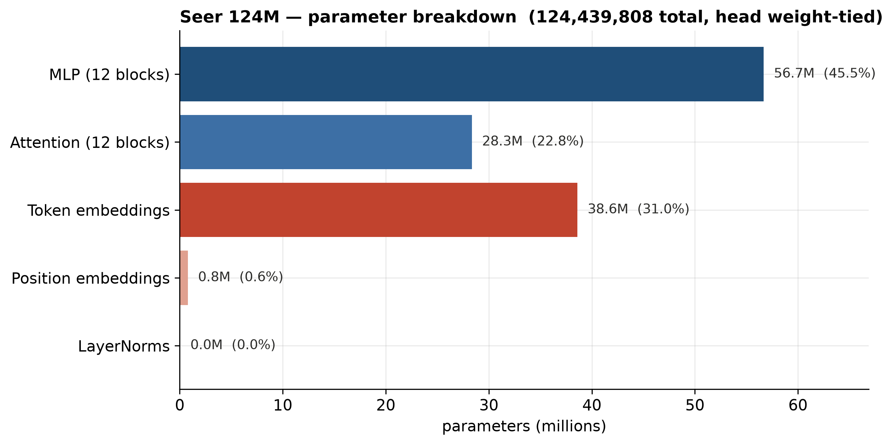
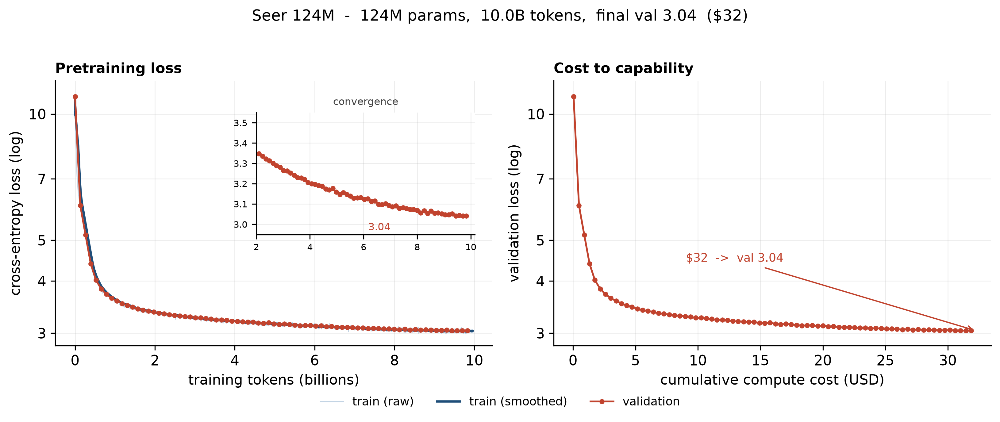
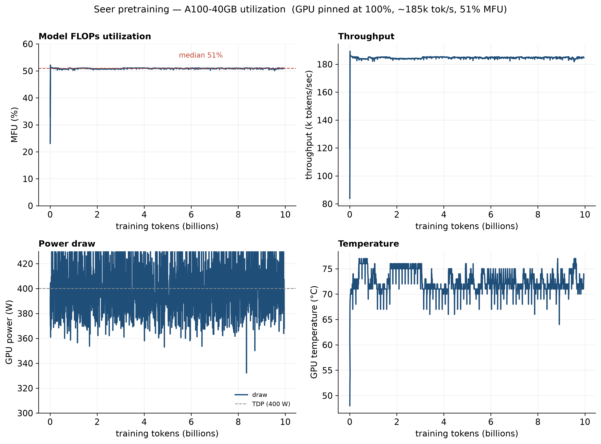
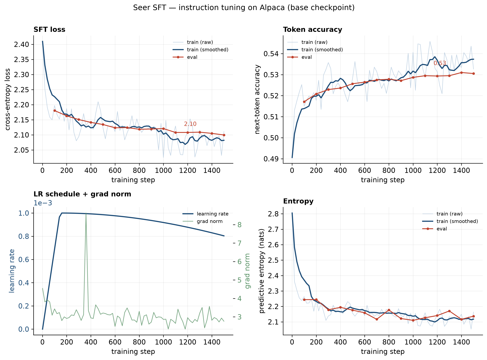
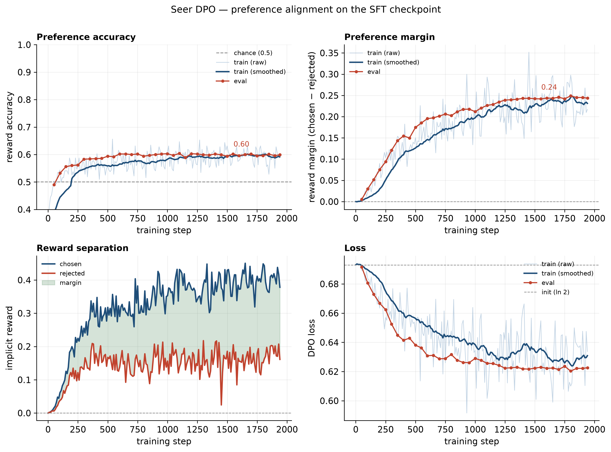
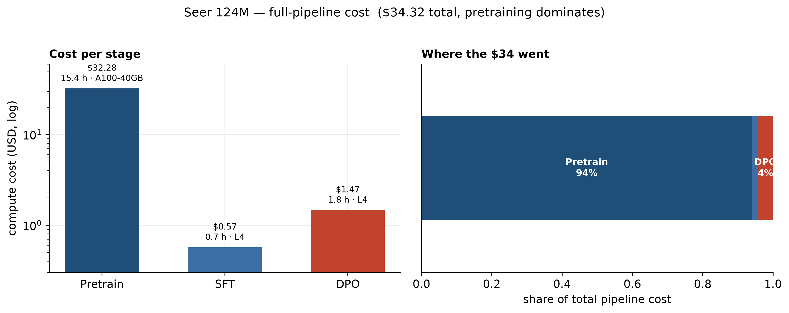

# Seer, a GPT-2-class LLM trained from scratch

> Built to learn every stage of the modern LLM pipeline

**Seer 124M** is an autoregressive language model (GPT-2 small architecture) trained from
corpus of ~10B tokens of educational web text, then post-trained with **SFT** and **DPO**.


| | |
|---|---|
| **Parameters** | 124,439,808 (12 layers, 12 heads, d=768, ctx=1024) |
| **Pretraining data** | FineWeb-Edu `sample-10BT` (~10B tokens, GPT-2 BPE) |
| **Pretraining compute** | 15.4 h on one A100-40GB · **$32.28** · 51% MFU |
| **Best val loss** | **3.04** |
| **HellaSwag (acc_norm)** | **0.324** - in line with published GPT-2 124M (~0.29) |
| **Full pipeline cost** | **$34.32** (pretrain + SFT + DPO) |
| **Stack** | PyTorch · Modal (A100/L4) · tiktoken · Hugging Face TRL · lm-evaluation-harness |

---

## Finding After Training

At 124M scale, I saw that post-training alignment didn't transfer 
to held-out instruction/truthfulness benchmarks.



- **Capability** (HellaSwag/ARC/PIQA/WinoGrande/LAMBADA) drops 2–3 points after SFT.
- **Instruction / truthfulness** (IFEval, TruthfulQA) stays **flat** within noise. I 
  re-ran IFEval with the exact Alpaca chat template applied, it did **not** increase the numbers above 
  the pre-training run. 
- Where post-training *did* work is visible in DPO's own metrics below.


---

## Architecture

A from-scratch GPT-2: token + position embeddings → 12 × (causal self-attention + MLP) →
final norm → weight-tied LM head. Written to be understood, not imported
([`src/models/GPT_model.py`](src/models/GPT_model.py)).



Notable: ~31% of the model is the token-embedding table, and the LM head is **weight-tied**
to it (adds nothing). Transformer Layer MLP + Attention layers are the largest compute-bearing share at 67.8%.

---

## Data pipeline

FineWeb-Edu (pre-filtered for educational quality) → `tiktoken` GPT-2 BPE → flat **`uint16`
`.bin` shards** (2 bytes/token, no header, 100M tokens/shard). A `.bin` file is literally a
wall of little-endian token IDs, so training reads it straight off disk with `np.memmap` and
draws random windows. Tokenize once on CPU, store the shards, stream batches on GPU.
Pipeline: [`src/data/prepare.py`](src/data/prepare.py).

---

## Pretraining

19,000 steps, 0.5M-token batches, AdamW, cosine LR with warmup, bf16 + `torch.compile`,
checkpointing to survive disconnects. Loss falls 11.0 → **3.04** over ~10B tokens.



The run pinned the A100 hard — **51% model-FLOPs utilization**, GPU at 100%, ~396 W (near the
400 W TDP), 185k tokens/sec sustained. 


### Base benchmarks (full sets, 0-shot, `lm-evaluation-harness`)

| HellaSwag | ARC-easy | ARC-challenge | PIQA | WinoGrande | LAMBADA | TruthfulQA | IFEval |
|---|---|---|---|---|---|---|---|
| 32.4% | 48.8% | 24.8% | 62.7% | 51.1% | 24.2% | 42.1% | 11.8% |

HellaSwag **0.324** meets the project's stated target (0.29) and sits in the published
GPT-2 124M range.

---

## SFT — instruction tuning on Alpaca

TRL `SFTTrainer`, 3 epochs on `tatsu-lab/alpaca`, Muon on hidden matrices + AdamW on
embeddings, L4 GPU, 42.7 min, ~$0.57. Loss 2.41 → 2.10, next-token accuracy 0.49 → 0.53.
The train/eval gap opening after ~step 1000 is why **checkpoint-1500** is used rather than the
later, more-overfit checkpoints.



---

## DPO — preference alignment

TRL `DPOTrainer` on `ultrafeedback_binarized`, β=0.1, starting from the SFT checkpoint, L4,
1.8 h, ~$1.47. 



- Reward accuracy 0.5 → **0.60**, preference margin → **0.24**, loss ln2 (0.69) → 0.62.
- Chosen and rejected implicit rewards cleanly separate.

The catch (see the eval section): these gains are *in-distribution*. They did not transfer to
held-out IFEval/TruthfulQA at this scale in my training and alignment runs.

---

## What each stage actually changed (generations)

Same prompts, greedy decoding, identical Alpaca format through each model:

| Prompt | Base | After SFT | After DPO |
|---|---|---|---|
| *Explain what a mitochondrion does in one sentence.* | *(repeats the prompt on a loop)* | "A mitochondrion is a type of organelle that produces energy in the form of ATP…" | "A mitochondrion is a type of organelle that produces energy in the form of ATP…" |
| *What is the capital of France?* | "What is the capital of France? What is the capital of France?…" | "The capital of France is Paris." *(then hallucinates population)* | "The capital of France is Paris." *(same)* |
| *Give one reason the sky appears blue.* | *(echoes prompt)* | "The sky appears blue because of the way the atmosphere absorbs blue light…" | "The sky appears blue because of the way the atmosphere absorbs blue light…" |

**Base → SFT is a night-and-day transformation** - instruction-following behavior appears
from nothing. **SFT → DPO is nearly indistinguishable** on free generation, likely need more rigorous testing to show the difference in the aligned model. The outputs are honestly imperfect 124M text: correct facts
mixed with hallucination and repetition loops. Full data: [`results/runs/generation_samples.json`](results/runs/generation_samples.json).

---

## Cost to capability



Pretraining is **94%** of the total spend; SFT and DPO together are under $2. For a small
model, the dollars go almost entirely into the base, the alignment stages are nearly free in my run.

| Stage | Hardware | Wall-clock | Cost |
|---|---|---|---|
| Pretrain | A100-40GB | 15.4 h | $32.28 |
| SFT | L4 | 42.7 min | $0.57 |
| DPO | L4 | 1.8 h | $1.47 |
| **Total** | | | **$34.32** |

---

## Reproduce it

```bash
uv sync
# data: tokenize FineWeb-Edu -> uint16 shards
uv run python -m src.data.prepare
# pretrain / post-train / eval run on Modal (A100 for pretrain, L4 for the rest)
uv run modal run src/training/modal_train.py                 # pretrain
uv run modal run src/training/modal_train.py::run_sft        # SFT
uv run modal run src/training/modal_train.py::run_dpo        # DPO
uv run modal run src/training/modal_train.py::run_evals      # base/sft/dpo benchmarks
# figures
uv run python src/utils/plot_training.py
uv run python src/utils/plot_eval_comparison.py
```

## Stack

PyTorch · Modal (serverless A100/L4) · tiktoken (GPT-2 BPE) · Hugging Face `datasets` /
`transformers` / TRL · EleutherAI `lm-evaluation-harness` · Weights & Biases.

## Lessons & Notes

- **`--limit` in lm-eval takes the first N docs, not a random sample** HellaSwag's first
  1,000 scored 39% vs 32.4% on the full set. Ran it this way to save time and compute.
- **At 124M, I didn't see an inprovment from SFT/DPO doesn't yield transferable instruction-following**
This is something that I need to redo and rerun these experiments to ensure this is a reproducable result 
or there was some sort of error in my setup.
- **Report variance and chance baselines.** Run-to-run noise in the eval is is prominent at this scale, and best to
reproduce these results thorugh multiple trials


